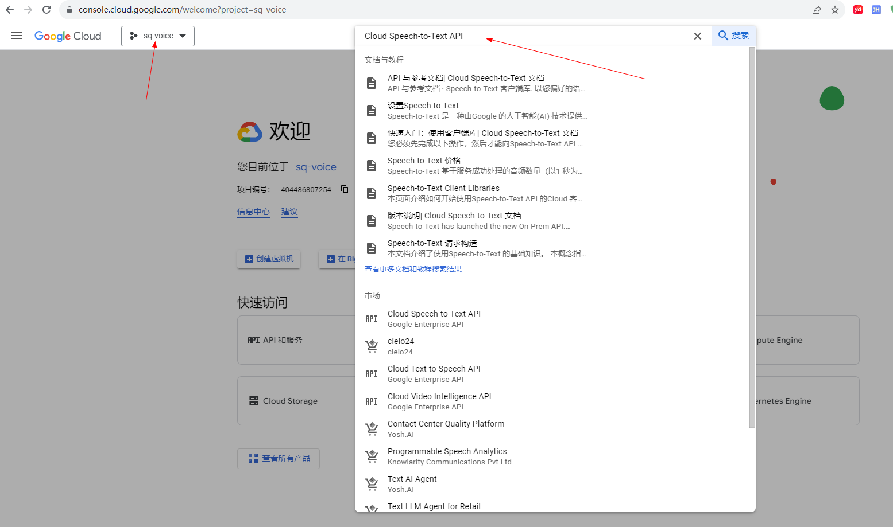
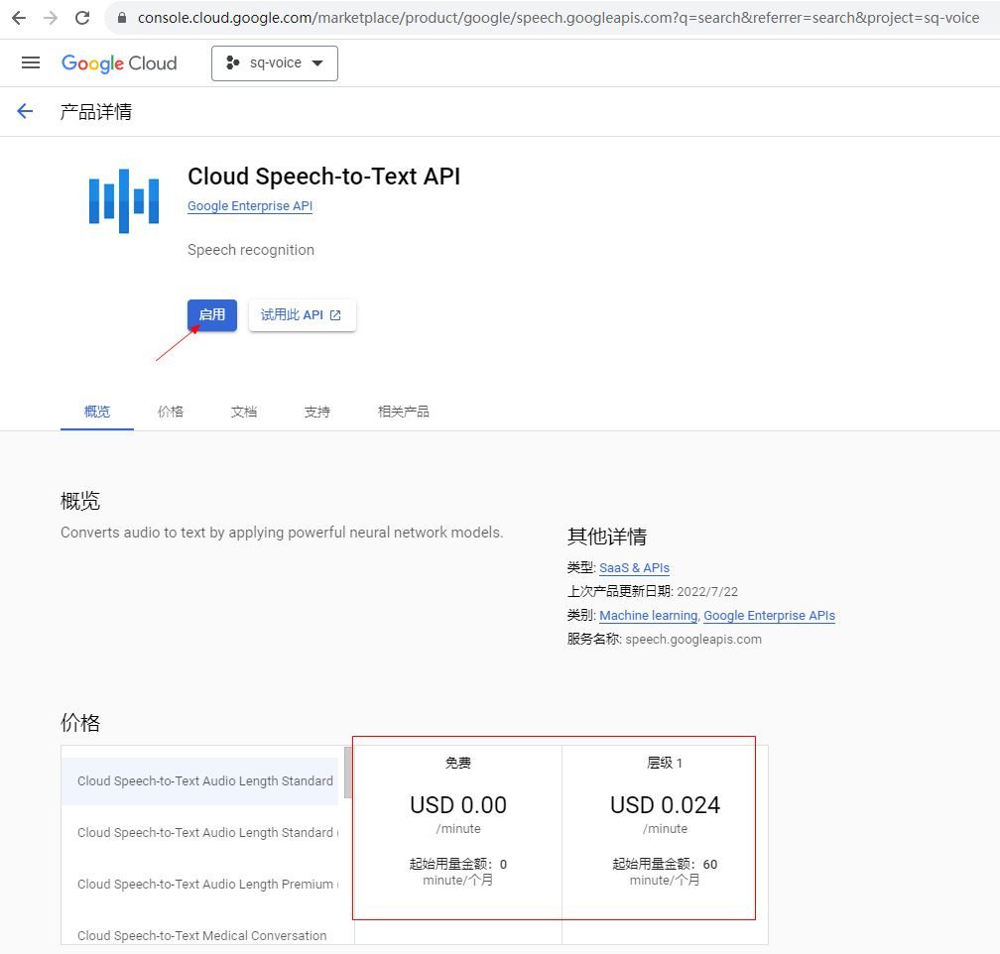
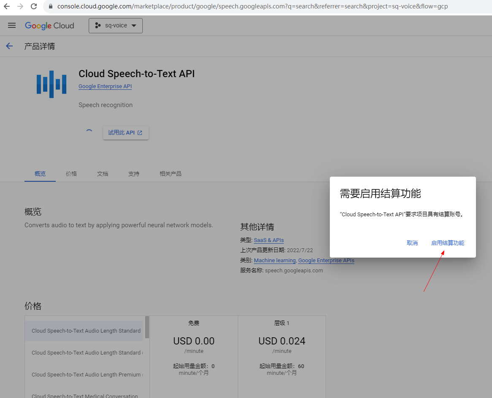
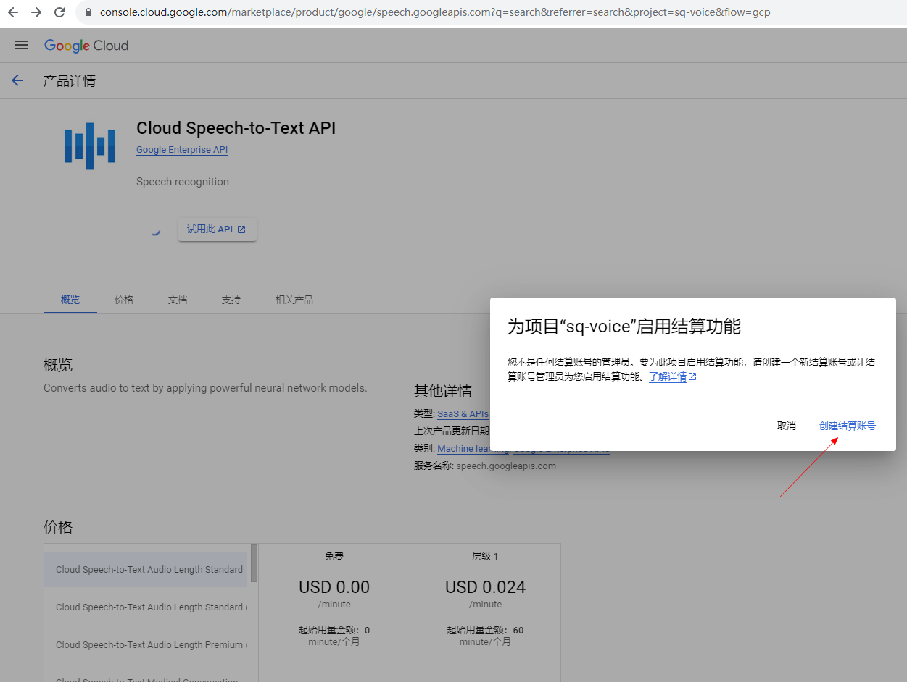
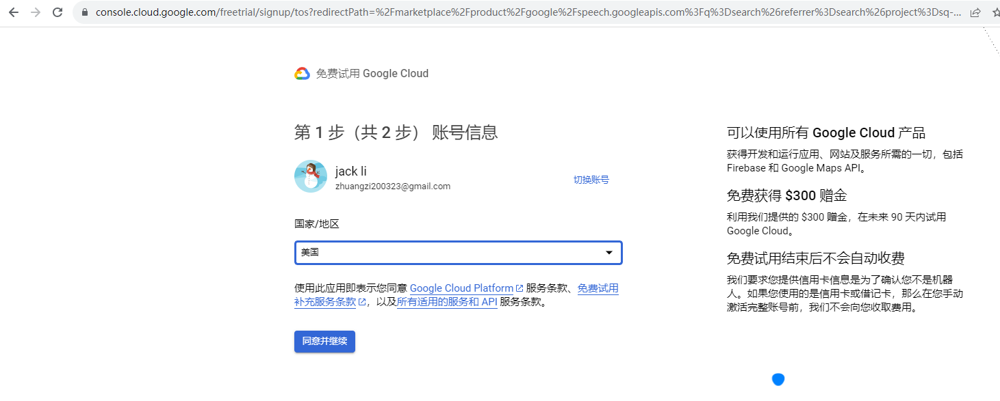
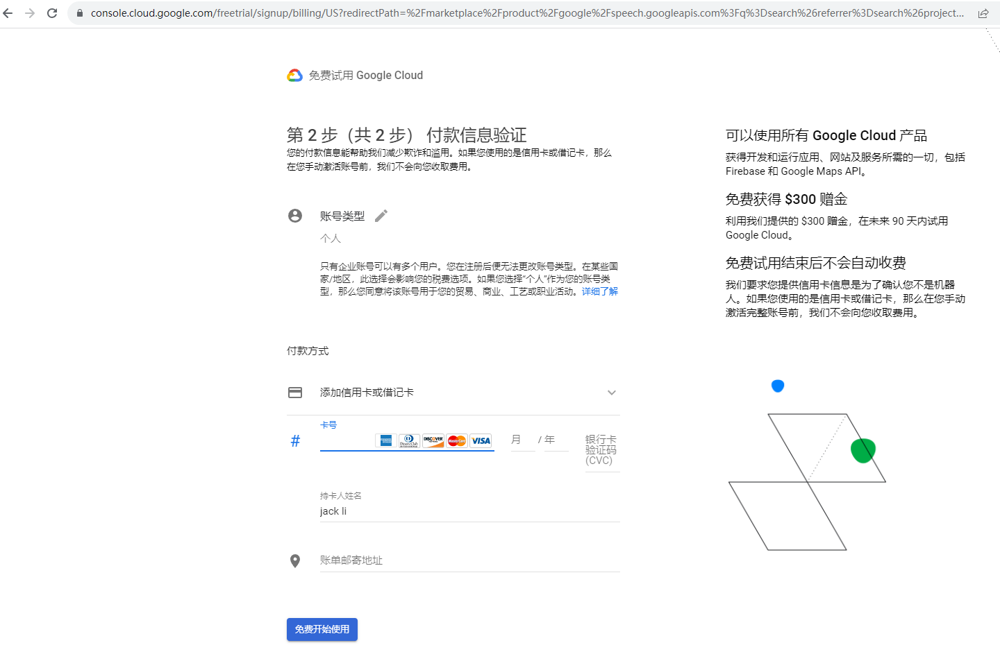

# GoogleVoiceDemo
调用google asr api
参考：https://github.com/GoogleCloudPlatform/android-docs-samples

使用说明：
1. 访问[https://console.cloud.google.com/welcome](https://console.cloud.google.com/welcome)，并使用google账号登录，选择项目后，搜索Cloud Speech-to-Text API，截图如下
   
2. 点击启用，会出现添加结算信息的提示，按照步骤添加银行卡信息，之后就可以使用了
   
   
   
   
   
3. 基本流程如下
## 设置Google Cloud 项目
## 确保有一个结算账号关联到该项目
## 启用 Speech-to-Text API
## 创建新的服务账号
## 创建JSON密钥
## 设置身份验证环境变量
